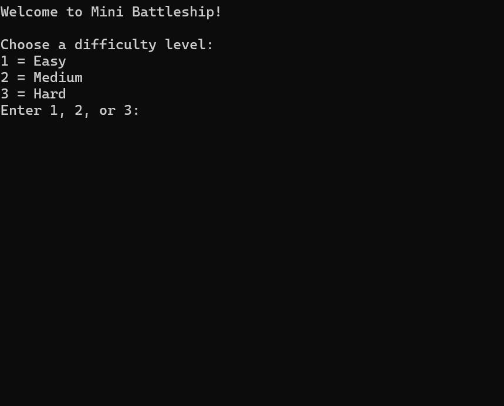

# Python Battleship Game

## Overview

This project is a command-line Battleship-style game developed in Python. The player attempts to locate and hit a hidden ship on a 4×4 game board before running out of attempts.

The project was created to practice Python programming fundamentals including loops, conditional statements, functions, input validation, and randomization.

## Features

* 4×4 interactive game board
* Random ship placement
* Horizontal or vertical ship orientation
* Five attempts to locate the ship
* Hit and miss detection
* Input validation
* Prevention of invalid board selections
* Multiple difficulty levels
* Game-ending win and loss conditions

## Technologies Used

* Python
* Python `random` module
* Command-line interface

## Programming Concepts Demonstrated

* Variables and data types
* Conditional statements
* While and for loops
* Functions
* User input
* Input validation
* Random number generation
* Game logic
* Problem-solving and debugging

## How the Game Works

1. The program creates a 4×4 game board.
2. A ship is randomly positioned on the board.
3. The player enters coordinates to guess the ship's location.
4. The program determines whether the guess is a hit or miss.
5. The player continues until the ship is found or all attempts have been used.
6. The game displays the final result.

## Game Preview

## What I Learned

This project strengthened my understanding of Python program flow and helped me learn how several programming concepts can work together within one application. I gained additional experience using loops, conditions, user input, validation, functions, and randomization while designing and debugging the game's logic.

## Future Improvements

Future versions of the project could include:

* A larger game board
* Multiple ships
* A graphical user interface
* Player scoring
* Saved high scores
* Two-player gameplay
* Additional difficulty settings

## Author

Tamera Johnson
